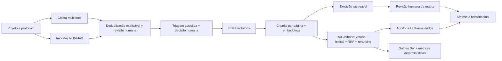

# RAG para Revisão Sistemática da Literatura


-blueviolet.svg)


Aplicação local para apoiar Revisões Sistemáticas da Literatura (RSL) com coleta
multifonte, triagem assistida por IA, RAG sobre texto integral, extração rastreável
de evidências, revisão humana, auditoria e síntese final.

O sistema foi projetado para manter o pesquisador no controle das decisões críticas.
A IA sugere, extrai e sintetiza; inclusão de artigos, aprovação das evidências e uso
do relatório permanecem sob responsabilidade humana.

## Sumário

- [Visão geral](#visão-geral)
- [Principais funcionalidades](#principais-funcionalidades)
- [Arquitetura](#arquitetura)
- [Instalação local](#instalação-local)
- [Atualização de um banco existente](#atualização-de-um-banco-existente)
- [Configuração segura](#configuração-segura)
- [Fluxo de uso](#fluxo-de-uso)
- [Testes](#testes)
- [Estrutura do projeto](#estrutura-do-projeto)
- [Segurança, dados e backup](#segurança-dados-e-backup)
- [Solução de problemas](#solução-de-problemas)
- [Limites atuais](#limites-atuais)

## Visão geral

O projeto combina PostgreSQL, `pgvector`, Streamlit e agentes de IA para cobrir o
fluxo de uma revisão dentro de projetos isolados. Cada projeto possui pergunta,
protocolo versionado, artigos, decisões, PDFs, embeddings, evidências, interações de
agentes, auditorias e relatórios próprios.

O perfil atual de implantação é **local e de usuário único**. As tabelas de
configuração já possuem campos de escopo para uma evolução futura, mas autenticação,
autorização e isolamento entre usuários ainda não fazem parte desta versão.

## Principais funcionalidades

### Projetos isolados e protocolo versionado

- Criação e seleção de múltiplos projetos de pesquisa.
- Isolamento do corpus e dos resultados por `project_id`.
- Versionamento da pergunta, PICO, critérios, estratégia de busca e perguntas de auditoria.
- Identificador estável de artigo por projeto, baseado no DOI normalizado ou no título normalizado.
- Consolidação de duplicatas com preservação da proveniência das diferentes fontes.

### Deduplicação explicável e revisável

- Cada registro recuperado recebe regra, pontuação, justificativa e evidências comparativas.
- DOI normalizado idêntico é consolidado automaticamente, com evento auditável.
- Título idêntico ou suficientemente semelhante aguarda decisão humana antes da triagem.
- Pontuação combina título (80%), autores (15%) e ano (5%), com limites registrados no JSONB.
- Comparação lado a lado de título, DOI, autores, ano, fontes e resumos.
- Decisão humana entre mesclar e manter separado, sempre com justificativa preservada.

### Coleta bibliográfica configurável

- Integração com **OpenAlex**, **Semantic Scholar** e **PubMed**.
- Importação de arquivos **BibTeX**, incluindo exportações do Web of Science.
- Prévia antes da importação, com contagem de registros válidos, sem DOI e sem abstract.
- Ativação ou desativação individual de cada fonte.
- Chaves opcionais armazenadas de forma cifrada, com `.env` como fallback.
- E-mail, identificação da aplicação, timeout e tentativas configuráveis.
- Teste de acesso sem persistir artigos.
- Retry limitado para falhas transitórias e respostas `429`.
- Registro da configuração pública usada na busca, sem segredos ou e-mail literal.
- Registro auditável do arquivo importado por nome, hash SHA-256, codificação e resultado.
- Preservação da entrada BibTeX bruta e encaminhamento de candidatos por título à revisão humana.

### Configuração central de IA

- Adaptador atual para Google Gemini.
- Credencial cifrada no banco, com `backend/.env` como fallback.
- Validação da chave pela listagem de modelos, sem gerar conteúdo.
- Modelo e temperatura configuráveis para formulação, triagem, RAG, auditoria,
  extração e relatório.
- Modelo de embedding configurável dentro do schema atual de 768 dimensões.
- Histórico de alterações sem exposição da chave.

### Triagem humana assistida

- Sugestão de inclusão ou exclusão, com confiança e justificativa.
- Decisão humana entre **Incluir**, **Excluir** e **Talvez**.
- Exclusão com categoria metodológica estruturada e justificativa textual obrigatória.
- Somente artigos incluídos seguem para PDFs, RAG e extração.
- Reavaliação de artigos incluídos quando o texto integral não pode ser obtido.
- Retorno à triagem ou exclusão posterior com justificativa e histórico preservado.

### PDFs e indexação vetorial rastreável

- Associação do PDF ao UUID do artigo incluído.
- Extração de texto por página com PyMuPDF.
- Remoção de caracteres NUL inválidos encontrados em alguns PDFs.
- Chunking por página, com sobreposição e preservação da origem.
- Embeddings armazenados em `vector(768)` no PostgreSQL.
- Indexação transacional por documento: uma falha desfaz apenas o PDF afetado.
- Relatório por artigo com status, chunks e motivo de falha.
- Detecção de índice legado ou incompatível com o modelo ativo.

### RAG híbrido e respostas fundamentadas

- Recuperação semântica por distância vetorial.
- Recuperação lexical pelo Full-Text Search do PostgreSQL.
- Fusão dos rankings com **Reciprocal Rank Fusion (RRF)**.
- Reranking opcional dos melhores candidatos com modelo generativo configurável.
- Fusão ponderada e configurável entre a ordem RRF e a ordem proposta pela IA.
- Registro em JSONB das posições RRF, IA e final, scores, justificativas, modelo e parâmetros.
- Nova tentativa controlada do reranking antes do fallback para a ordem segura do RRF.
- Registro do motivo, das tentativas e da eventual recuperação do reranking.
- Filtro pelo projeto ativo e pelo modelo de embedding configurado.
- Recuperação restrita a chunks de PDF com página de origem registrada.
- Citações validadas no formato `[paper_id, p. página]`.
- Referências bibliográficas internas, como `[36]`, são explicitamente desambiguadas.
- Recusa quando não há contexto suficiente.
- Segunda leitura conservadora quando uma recusa conflita com evidências potencialmente fortes.
- Registro da pergunta, resposta, evidências recuperadas e configuração do modelo.

### Matriz de evidências rastreáveis

- Extração de objetivo, método, dataset/amostra, métricas, resultados e limitações.
- Cada valor precisa possuir citação literal, `chunk_id` e página de origem.
- Citações inexistentes no trecho indicado são descartadas.
- Revisão humana com estados pendente, aprovada, corrigida e rejeitada.
- Preservação da saída original e da versão revisada.
- Funil separado para PDF associado, indexado, extraído e revisado.
- Exportação CSV em UTF-8 com BOM, preservando acentuação no Excel.

### Auditoria e relatório final

- Fluxo PRISMA operacional calculado diretamente dos dados do projeto, sem estimativas da IA.
- Separação entre registros identificados, deduplicação, triagem, texto integral,
  extração e estudos efetivamente incluídos na síntese.
- Motivos de exclusão consolidados por etapa.
- Snapshots imutáveis vinculados à versão do protocolo e armazenados em JSONB.
- Diagrama vetorial e exportações JSON e CSV para auditoria e apresentação.
- Perguntas de auditoria configuráveis e versionadas no protocolo.
- Avaliação `LLM-as-a-Judge` de fidelidade e relevância.
- Persistência das execuções e métricas no projeto ativo.
- Síntese somente com evidências rastreáveis aprovadas ou corrigidas.
- Citações no formato `[paper_id, p. página]` e download em Markdown.

### Avaliação quantitativa reprodutível do RAG

- Golden Set definido por julgamento humano e isolado por projeto.
- Perguntas respondíveis ligadas a artigos, páginas opcionais e graus de relevância.
- Perguntas fora do corpus marcadas com expectativa explícita de recusa.
- Versionamento imutável do gabarito após cada alteração.
- Cálculo determinístico de `Precision@k`, `Recall@k`, `Hit Rate@k`, MRR e `nDCG@k`.
- Comparação entre RRF, reranking puro da IA e fusão usando o mesmo conjunto de perguntas.
- Calibração de pesos sem novas chamadas à API, com recomendação baseada no Golden Set.
- Cobertura explícita da amostra comparável e alerta quando fallbacks tornam a recomendação parcial.
- Taxas de recusa correta, recusa indevida, validade e conformidade das citações.
- Execuções persistidas em JSONB com Golden Set, hash e configurações exatas dos modelos.
- Recuperação automática de erros transitórios `429`/`503`, com espera exponencial,
  rastreabilidade das tentativas e preservação dos resultados parciais.
- Interpretação automática e exportações JSON e CSV.

## Arquitetura



| Camada | Tecnologia e responsabilidade |
|---|---|
| Interface | Streamlit multipágina |
| Aplicação | Python, agentes e serviços de configuração |
| Banco | PostgreSQL 16 com `pgvector` |
| IA | Google Gemini com configuração central por função |
| Coleta | OpenAlex, Semantic Scholar, NCBI E-utilities/PubMed e BibTeX |
| Documentos | PyMuPDF para leitura e segmentação por página |
| Segurança local | Fernet e chave-mestra fora do banco |

## Instalação local

### Pré-requisitos

- Git.
- Python 3.10 ou superior.
- Docker Desktop em execução.
- No Windows, Docker configurado para containers Linux; WSL 2 é recomendado.

### 1. Clonar o repositório

```bash
git clone https://github.com/lucianodiassp/rag-revisao-sistematica.git
cd rag-revisao-sistematica
```

### 2. Criar o ambiente Python

Windows PowerShell:

```powershell
python -m venv venv
.\venv\Scripts\Activate.ps1
pip install -r requirements.txt
```

Linux ou macOS:

```bash
python3 -m venv venv
source venv/bin/activate
pip install -r requirements.txt
```

### 3. Criar o arquivo de ambiente

Windows PowerShell:

```powershell
Copy-Item backend\.env.example backend\.env
```

Linux ou macOS:

```bash
cp backend/.env.example backend/.env
```

Configuração mínima de infraestrutura:

```env
DB_HOST=localhost
DB_PORT=5432
DB_NAME=rag_systematic_review
DB_USER=rag_user
DB_PASSWORD=rag_password
```

Para a primeira execução, informe uma chave Gemini no arquivo ou cadastre-a depois
pela página **Configuração de IA**:

```env
GEMINI_API_KEY="sua-chave-api-do-google-aqui"
```

Os modelos iniciais e as variáveis opcionais estão em
[`backend/.env.example`](backend/.env.example). Como a disponibilidade varia entre
contas, use a tela de IA para testar a chave e consultar os modelos liberados antes
de executar o pipeline completo.

> Nunca publique `backend/.env`. O arquivo é ignorado pelo Git.

### 4. Subir PostgreSQL e pgAdmin

```bash
docker compose up -d
docker compose ps
```

| Serviço | Endereço/porta |
|---|---|
| PostgreSQL + pgvector | `localhost:5432` |
| pgAdmin | [http://localhost:5050](http://localhost:5050) |

Credenciais de desenvolvimento do pgAdmin:

- E-mail: `admin@rag.com`
- Senha: `admin`

Substitua essas credenciais antes de qualquer implantação compartilhada.

### 5. Iniciar a aplicação

```bash
python -m streamlit run frontend/app.py
```

Acesse [http://localhost:8501](http://localhost:8501).

## Atualização de um banco existente

Os scripts de `docker-entrypoint-initdb.d` são executados automaticamente somente
quando o volume do PostgreSQL é criado. Se já existe o volume
`rag_postgres_data`, recrie apenas o container e aplique as migrações uma vez:

```bash
docker compose up -d --force-recreate db
docker compose exec -T db psql -U rag_user -d rag_systematic_review -f /docker-entrypoint-initdb.d/z98_project_isolation.sql
docker compose exec -T db psql -U rag_user -d rag_systematic_review -f /docker-entrypoint-initdb.d/z99_traceable_evidence.sql
docker compose exec -T db psql -U rag_user -d rag_systematic_review -f /docker-entrypoint-initdb.d/zz100_ai_configuration.sql
docker compose exec -T db psql -U rag_user -d rag_systematic_review -f /docker-entrypoint-initdb.d/zz101_bibliographic_sources.sql
docker compose exec -T db psql -U rag_user -d rag_systematic_review -f /docker-entrypoint-initdb.d/zz102_screening_reassessment.sql
docker compose exec -T db psql -U rag_user -d rag_systematic_review -f /docker-entrypoint-initdb.d/zz103_explainable_deduplication.sql
docker compose exec -T db psql -U rag_user -d rag_systematic_review -f /docker-entrypoint-initdb.d/zz104_reranking_configuration.sql
docker compose exec -T db psql -U rag_user -d rag_systematic_review -f /docker-entrypoint-initdb.d/zz105_prisma_reporting.sql
docker compose exec -T db psql -U rag_user -d rag_systematic_review -f /docker-entrypoint-initdb.d/zz106_rag_benchmark.sql
```

As migrações são idempotentes e preservam os dados. A migração de isolamento cria
um projeto legado quando encontra registros da versão anterior.

## Configuração segura

### Configuração de IA

Na página **4. Configuração de IA** é possível:

1. Testar e salvar uma nova chave Gemini.
2. Importar a chave presente em `backend/.env`.
3. Consultar os modelos liberados para a credencial.
4. Selecionar modelos e temperaturas por função.
5. Ativar o reranking e configurar candidatos, trechos finais e peso da ordem RRF.
6. Configurar o modelo de embedding.
7. Consultar a configuração efetiva e o histórico.

Trocar o modelo de embedding exige nova indexação dos PDFs. O sistema identifica o
índice incompatível, reconstrói o documento de forma transacional e devolve a
extração afetada para revisão humana.

### Fontes bibliográficas

Na página **6. Fontes Bibliográficas** é possível configurar OpenAlex, Semantic
Scholar e PubMed individualmente. Chaves são opcionais quando a API permite acesso
sem autenticação.

O banco cifrado tem precedência. Na ausência de configuração persistida, são usados
os valores de `backend/.env`, incluindo:

- `OPENALEX_API_KEY`
- `SEMANTIC_SCHOLAR_API_KEY`
- `PUBMED_API_KEY`
- `BIBLIOGRAPHIC_CONTACT_EMAIL`
- `BIBLIOGRAPHIC_TIMEOUT_SECONDS`
- `BIBLIOGRAPHIC_MAX_RETRIES`
- variáveis específicas listadas em `backend/.env.example`

### Chave-mestra local

As credenciais são cifradas com Fernet antes de chegar ao PostgreSQL. A chave-mestra
fica no diretório privado de dados do usuário, fora do repositório e do banco. O
caminho efetivo aparece nas telas de configuração.

Variáveis avançadas para recuperação ou gestão externa:

- `AI_LOCAL_MASTER_KEY_PATH`
- `AI_LOCAL_MASTER_KEY`

Ao restaurar o banco em outro computador sem a chave-mestra correspondente,
recadastre as credenciais pelas telas de configuração.

## Fluxo de uso

### 1. Configurar a instalação

- Abra **4. Configuração de IA**, valide a chave e selecione modelos disponíveis.
- Abra **6. Fontes Bibliográficas**, habilite as fontes e teste os acessos.

### 2. Criar o projeto e o protocolo

- Abra **0. Configuração da Pesquisa**.
- Crie ou selecione um projeto.
- Informe a pergunta e solicite a estruturação PICO.
- Revise critérios e estratégia de busca.
- Consulte as APIs habilitadas e/ou importe um arquivo `.bib`.
- Confira a prévia e o relatório da importação antes de seguir para a triagem.

### 3. Revisar possíveis duplicatas

- Abra **7. Deduplicação**.
- Confira a regra, a pontuação e os metadados apresentados lado a lado.
- Para cada item pendente, decida entre mesclar ou manter os artigos separados.
- Registre a justificativa; artigos mantidos separados são liberados para a Triagem.

### 4. Realizar a triagem

- Abra **1. Triagem**.
- Execute a sugestão da IA quando desejado.
- Registre a decisão humana para cada artigo.

### 5. Associar e indexar PDFs

- Abra **5. Gestão de PDFs**.
- Envie o PDF de cada artigo incluído.
- Se o PDF não puder ser obtido legalmente, devolva o artigo à triagem ou exclua-o com justificativa.
- Execute o processamento e acompanhe o resultado por documento.
- Confirme no funil a diferença entre PDF armazenado e PDF indexado.

### 6. Consultar o corpus pelo RAG

- Retorne à página inicial **Assistente de Revisão Sistemática**.
- Faça perguntas sobre o texto integral indexado.
- Confira as citações com UUID e página no formato `[paper_id, p. página]`.
- Abra **Como as evidências foram selecionadas** para comparar posições RRF, IA e final,
  além dos scores do modelo e da fusão.

### 7. Extrair e revisar evidências

- Abra **2. Matriz de Evidências**.
- Execute a extração dos PDFs indexados.
- Compare citação, página e PDF em cada campo.
- Aprove, corrija ou rejeite cada extração.
- Baixe a matriz em CSV quando necessário.

### 8. Medir o RAG com Golden Set

- Abra **8. Avaliação Quantitativa RAG**.
- Cadastre perguntas que o corpus deve responder e associe as fontes relevantes.
- Cadastre perguntas fora do escopo marcando que o sistema deve recusá-las.
- Execute o benchmark e compare RRF, reranking puro da IA e fusão configurada.
- Confirme o tamanho da amostra comparável; perguntas sem ranking da IA são excluídas
  igualmente dos três pipelines e permanecem visíveis nos resultados operacionais.
- Interprete Precision, Recall, Hit Rate, MRR, nDCG, recusas e citações.
- Consulte a curva de calibração. O peso `0` usa somente a ordem da IA e o peso `1`
  preserva somente o RRF. Trate recomendações com menos de dez perguntas respondíveis
  como exploratórias.
- Se o provedor estiver temporariamente indisponível, aguarde as novas tentativas
  automáticas; uma pergunta que continue falhando será registrada sem interromper as demais.
- Consulte por pergunta o motivo do fallback, as tentativas do reranking e a eventual
  reavaliação de uma recusa inicial.
- Baixe o resultado em JSON ou CSV.

### 9. Auditar e gerar o relatório

- Abra **3. Relatório Final**.
- Configure as perguntas de auditoria.
- Execute o juiz e analise fidelidade e relevância.
- Gere a síntese após aprovar ou corrigir as evidências.
- Baixe o relatório em Markdown.

### Execução opcional pelo terminal

Quando houver mais de um projeto, defina `PROJECT_ID` antes de executar módulos
diretamente.

Windows PowerShell:

```powershell
$env:PROJECT_ID = "uuid-do-projeto"
python backend\coleta\orquestrador_coleta.py
python backend\processamento\leitor_pdf.py
python backend\agentes\agente_avaliador.py
```

Linux ou macOS:

```bash
export PROJECT_ID="uuid-do-projeto"
python backend/coleta/orquestrador_coleta.py
python backend/processamento/leitor_pdf.py
python backend/agentes/agente_avaliador.py
```

## Testes

Execute a suíte automatizada:

```bash
python -m unittest discover -s tests -v
```

A suíte cobre configuração de IA, armazenamento de segredos, fontes bibliográficas,
importação BibTeX, deduplicação explicável, reranking com fallback, métricas do
Golden Set, isolamento por projeto, indexação de PDFs e evidências rastreáveis.

Os testes SQL de integração ficam em `tests/*.sql`. Exemplo no PowerShell:

```powershell
Get-Content tests\project_isolation_integration.sql |
  docker compose exec -T db psql -U rag_user -d rag_systematic_review -v ON_ERROR_STOP=1
```

Esses scripts usam transações com `ROLLBACK` e não devem deixar dados de teste
persistidos. O roteiro funcional está em
[`docs/roteiro_testes.md`](docs/roteiro_testes.md).

## Estrutura do projeto

```text
rag-revisao-sistematica/
├── backend/
│   ├── agentes/                 # Formulação, triagem, RAG, extração, auditoria e relatório
│   ├── app/                     # Banco, configurações, segurança e utilitários
│   ├── coleta/                  # Coletores e orquestrador das fontes
│   ├── processamento/           # PDFs, chunks, embeddings e recuperação
│   └── .env.example
├── database/scripts/            # Schema, migrações e consultas de auditoria
├── docs/                        # Blueprint e roteiro de testes funcionais
├── frontend/
│   ├── app.py                   # Chat RAG
│   └── pages/                   # Fluxo multipágina do Streamlit
├── tests/                       # Testes unitários e SQL de integração
├── data/pdfs/                   # PDFs locais, ignorados pelo Git
├── docker-compose.yml
└── requirements.txt
```

## Segurança, dados e backup

### Arquivos e dados locais

- `backend/.env` contém segredos de fallback e é ignorado pelo Git.
- `data/pdfs/*.pdf` é ignorado pelo Git.
- O volume `rag_postgres_data` contém o PostgreSQL.
- A chave-mestra local não está no banco nem no repositório.
- CSV e relatório Markdown são gerados para download pela interface.

### Backup mínimo

Para recuperar a revisão em outra máquina, considere separadamente:

1. dump do banco PostgreSQL;
2. diretório `data/pdfs`;
3. chave-mestra local, caso as credenciais cifradas precisem ser reutilizadas.

Sem a chave-mestra, mantenha o banco e os PDFs e recadastre somente as chaves das APIs.

### Parar os serviços

Sem remover o banco:

```bash
docker compose down
```

Removendo também o volume PostgreSQL:

```bash
docker compose down -v
```

> `docker compose down -v` remove permanentemente o banco do volume. Os PDFs da
> pasta `data/pdfs` não são removidos por esse comando.

## Solução de problemas

| Sintoma | Verificação recomendada |
|---|---|
| `dockerDesktopLinuxEngine` não encontrado | Inicie o Docker Desktop e confirme o uso de containers Linux. |
| Página informa migração ausente | Execute [Atualização de um banco existente](#atualização-de-um-banco-existente). |
| Modelo Gemini indisponível | Abra **Configuração de IA**, teste a chave e escolha um modelo listado para a conta. |
| Erro `429` em uma API | Aguarde a renovação do limite, reduza chamadas ou use uma credencial com cota adequada. |
| PDF armazenado, mas não indexado | Execute a vetorização e consulte o motivo individual apresentado na página. |
| Vários projetos ao executar um script | Defina `PROJECT_ID` explicitamente. |
| Credencial cifrada não pode ser aberta | Restaure a chave-mestra correta ou cadastre novamente a credencial. |
| Acentos incorretos no CSV | Use o arquivo da interface; ele é exportado como UTF-8 com BOM. |
| Resposta mostra "referência bibliográfica nº 36" | É uma referência interna do artigo, não uma página. A fonte rastreável aparece como `[paper_id, p. página]`. |
| BibTeX não é aceito | Confirme a extensão `.bib`, o limite de 20 MB e se todas as chaves e aspas estão fechadas. |

## Limites atuais

- Instalação local de usuário único, sem login ou autorização.
- Adaptador de IA implementado apenas para Google Gemini.
- Schema vetorial fixado em 768 dimensões.
- Coleta dependente da disponibilidade, cobertura e limites das APIs externas.
- Campos ausentes no BibTeX permanecem identificados como indisponíveis e exigem revisão na triagem.
- Decisões de deduplicação anteriores à migração 007 não recebem histórico retroativo.
- O diagrama implementa um fluxo PRISMA operacional adaptado às etapas observáveis
  pela aplicação; ele não substitui a avaliação metodológica nem a conferência do
  checklist PRISMA 2020 pelo pesquisador.
- PDFs baseados somente em imagem exigem OCR, ainda não integrado.
- Relatório e decisões produzidos com IA exigem revisão científica humana.
- O reranking generativo acrescenta uma chamada de IA por pergunta quando está ativo e
  pode realizar uma segunda tentativa controlada quando a primeira saída falha.
- Uma recusa pode provocar uma segunda leitura quando as evidências selecionadas possuem
  score forte ou vieram de um fallback sem score; a reavaliação continua autorizada a recusar.
- O peso sugerido pelo benchmark é específico do projeto e depende da diversidade e
  qualidade do Golden Set; ele não é aplicado automaticamente à configuração global.
- As métricas do benchmark refletem a qualidade do Golden Set humano; um gabarito
  pequeno, ambíguo ou incompleto pode produzir conclusões enganosas.
- O sistema não substitui protocolo metodológico, avaliação de risco de viés ou
  julgamento do pesquisador.

## Licença

Distribuído sob a licença MIT. Consulte [`LICENSE`](LICENSE).
