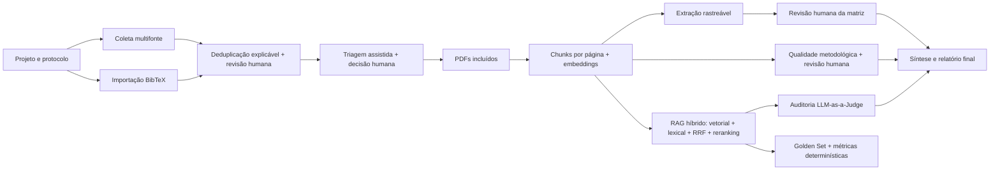

# RAG para Revisão Sistemática da Literatura


-blueviolet.svg)


Aplicação local para apoiar Revisões Sistemáticas da Literatura (RSL) com coleta
multifonte, triagem assistida por IA, RAG sobre texto integral, extração rastreável
de evidências, avaliação metodológica revisada por humano, auditoria e síntese final.

O sistema foi projetado para manter o pesquisador no controle das decisões críticas.
A IA sugere, extrai e sintetiza; inclusão de artigos, aprovação das evidências e uso
do relatório permanecem sob responsabilidade humana.

## Sumário

- [Visão geral](#visão-geral)
- [Principais funcionalidades](#principais-funcionalidades)
- [Arquitetura](#arquitetura)
- [Instalação local](#instalação-local)
- [Projeto demonstrativo](#projeto-demonstrativo)
- [Atualização de um banco existente](#atualização-de-um-banco-existente)
- [Configuração segura](#configuração-segura)
- [Fluxo de uso](#fluxo-de-uso)
- [Testes](#testes)
- [Estrutura do projeto](#estrutura-do-projeto)
- [Segurança, dados e backup](#segurança-dados-e-backup)
- [Solução de problemas](#solução-de-problemas)
- [Limites atuais](#limites-atuais)

## Visão geral

O projeto combina PostgreSQL, `pgvector`, Streamlit e agentes de IA para cobrir o
fluxo de uma revisão dentro de projetos isolados. Cada projeto possui pergunta,
protocolo versionado, artigos, decisões, PDFs, embeddings, evidências, interações de
agentes, auditorias e relatórios próprios.

O perfil atual de implantação é **local e de usuário único**. As tabelas de
configuração já possuem campos de escopo para uma evolução futura, mas autenticação,
autorização e isolamento entre usuários ainda não fazem parte desta versão.

## Principais funcionalidades

### Projetos isolados e protocolo versionado

- Criação e seleção de múltiplos projetos de pesquisa.
- Isolamento do corpus e dos resultados por `project_id`.
- Versionamento da pergunta, PICO, critérios, estratégia de busca e perguntas de auditoria.
- Identificador estável de artigo por projeto, baseado no DOI normalizado ou no título normalizado.
- Consolidação de duplicatas com preservação da proveniência das diferentes fontes.

### Projeto demonstrativo reproduzível

- Carga idempotente com identificadores UUID determinísticos e isolamento próprio.
- Sete registros de OpenAlex, PubMed e Semantic Scholar, consolidados em cinco
  publicações reais, com duas duplicatas explicadas.
- Protocolo PICO, triagem humana concluída, quatro inclusões, uma exclusão,
  matriz rastreável, snapshot PRISMA e Golden Set inicial.
- Instrumento metodológico genérico v1 e quatro avaliações humanas marcadas como
  incertas, pois os cartões demonstrativos não substituem os textos integrais.
- Quatro cartões PDF gerados localmente, com atribuição e aviso de escopo, sem
  redistribuir os artigos integrais.
- Nenhuma chamada à IA ou armazenamento de chave durante a carga.
- Restauração explícita limitada ao projeto marcado como demonstração.

### Backup e restauração seguros

- Backup completo do PostgreSQL, PDFs e chave-mestra em um único `.ragbackup`.
- Proteção por senha com `scrypt` e AES-256-GCM, sem armazenar a senha.
- Manifesto com versão, contagens, tamanhos e hashes SHA-256 dos componentes.
- Validação somente leitura antes de habilitar a restauração.
- Confirmação textual para operações destrutivas.
- Backup automático do estado atual antes de restaurar outro arquivo.
- Restauração transacional do banco, seguida pelas migrações idempotentes.
- Retorno automático ao estado anterior quando uma etapa da restauração falha.

### Pacote de reprodutibilidade por projeto

- Exportação acadêmica de um projeto em ZIP, separada do backup operacional da instalação.
- Importação seletiva do ZIP como novo projeto, sem substituir a instalação ou outros projetos.
- Validação de formato, escopo, limites, contagens e SHA-256 antes de gravar qualquer dado.
- Reconstrução transacional com novos UUIDs e remapeamento das referências internas.
- Protocolo atual e histórico, buscas, registros recuperados, deduplicação, triagem e reavaliações.
- Inventário da indexação sem copiar PDFs, texto integral dos chunks ou vetores de embedding.
- Matriz de evidências em CSV, extrações com fontes literais e avaliações metodológicas.
- Snapshots PRISMA, Golden Set, benchmarks, auditorias e interações dos agentes.
- Configurações de modelos efetivamente registradas nas interações, sem credenciais.
- Inclusão da última síntese persistida pelo Agente Relator, quando disponível.
- Manifesto versionado com contagens, tamanho e hash SHA-256 de cada arquivo.
- Remoção defensiva de campos sensíveis e arquivos CSV em UTF-8 com BOM.

### Deduplicação explicável e revisável

- Cada registro recuperado recebe regra, pontuação, justificativa e evidências comparativas.
- DOI normalizado idêntico é consolidado automaticamente, com evento auditável.
- Título idêntico ou suficientemente semelhante aguarda decisão humana antes da triagem.
- Pontuação combina título (80%), autores (15%) e ano (5%), com limites registrados no JSONB.
- Comparação lado a lado de título, DOI, autores, ano, fontes e resumos.
- Decisão humana entre mesclar e manter separado, sempre com justificativa preservada.

### Coleta bibliográfica configurável

- Integração com **OpenAlex**, **Semantic Scholar** e **PubMed**.
- Importação de arquivos **BibTeX**, incluindo exportações do Web of Science.
- Prévia antes da importação, com contagem de registros válidos, sem DOI e sem abstract.
- Ativação ou desativação individual de cada fonte.
- Chaves opcionais armazenadas de forma cifrada, com `.env` como fallback.
- E-mail, identificação da aplicação, timeout e tentativas configuráveis.
- Teste de acesso sem persistir artigos.
- Retry limitado para falhas transitórias e respostas `429`.
- Registro da configuração pública usada na busca, sem segredos ou e-mail literal.
- Registro auditável do arquivo importado por nome, hash SHA-256, codificação e resultado.
- Preservação da entrada BibTeX bruta e encaminhamento de candidatos por título à revisão humana.

### Configuração central de IA

- Adaptador atual para Google Gemini.
- Credencial cifrada no banco, com `backend/.env` como fallback.
- Validação da chave pela listagem de modelos, sem gerar conteúdo.
- Modelo e temperatura configuráveis para formulação, triagem, RAG, auditoria,
  extração, qualidade metodológica e relatório.
- Modelo de embedding configurável dentro do schema atual de 768 dimensões.
- Histórico de alterações sem exposição da chave.

### Triagem humana assistida

- Sugestão de inclusão ou exclusão, com confiança e justificativa.
- Decisão humana entre **Incluir**, **Excluir** e **Talvez**.
- Exclusão com categoria metodológica estruturada e justificativa textual obrigatória.
- Somente artigos incluídos seguem para PDFs, RAG e extração.
- Reavaliação de artigos incluídos quando o texto integral não pode ser obtido.
- Retorno à triagem ou exclusão posterior com justificativa e histórico preservado.

### PDFs e indexação vetorial rastreável

- Associação do PDF ao UUID do artigo incluído.
- Extração de texto por página com PyMuPDF.
- OCR local por página com Tesseract para documentos digitalizados, em português e inglês.
- Detecção conservadora: o OCR só é acionado quando a camada nativa é insuficiente.
- Proveniência do método de extração, idioma e DPI preservada nos chunks.
- Remoção de caracteres NUL inválidos encontrados em alguns PDFs.
- Chunking por página, com sobreposição e preservação da origem.
- Embeddings armazenados em `vector(768)` no PostgreSQL.
- Indexação transacional por documento: uma falha desfaz apenas o PDF afetado.
- Relatório por artigo com status, chunks e motivo de falha.
- Detecção de índice legado ou incompatível com o modelo ativo.

### RAG híbrido e respostas fundamentadas

- Recuperação semântica por distância vetorial.
- Recuperação lexical pelo Full-Text Search do PostgreSQL.
- Fusão dos rankings com **Reciprocal Rank Fusion (RRF)**.
- Reranking opcional dos melhores candidatos com modelo generativo configurável.
- Fusão ponderada e configurável entre a ordem RRF e a ordem proposta pela IA.
- Registro em JSONB das posições RRF, IA e final, scores, justificativas, modelo e parâmetros.
- Nova tentativa controlada do reranking antes do fallback para a ordem segura do RRF.
- Registro do motivo, das tentativas e da eventual recuperação do reranking.
- Filtro pelo projeto ativo e pelo modelo de embedding configurado.
- Recuperação restrita a chunks de PDF com página de origem registrada.
- Citações validadas no formato `[paper_id, p. página]`.
- Referências bibliográficas internas, como `[36]`, são explicitamente desambiguadas.
- Recusa quando não há contexto suficiente.
- Segunda leitura conservadora quando uma recusa conflita com evidências potencialmente fortes.
- Registro da pergunta, resposta, evidências recuperadas e configuração do modelo.

### Matriz de evidências rastreáveis

- Extração de objetivo, método, dataset/amostra, métricas, resultados e limitações.
- Cada valor precisa possuir citação literal, `chunk_id` e página de origem.
- Citações inexistentes no trecho indicado são descartadas.
- Revisão humana com estados pendente, aprovada, corrigida e rejeitada.
- Preservação da saída original e da versão revisada.
- Funil separado para PDF associado, indexado, extraído e revisado.
- Exportação CSV em UTF-8 com BOM, preservando acentuação no Excel.

### Qualidade metodológica e possíveis vieses

- Checklist genérico configurável e versionado por projeto, com oito domínios iniciais.
- Nova versão preserva o histórico e exige nova avaliação dos estudos sob o instrumento ativo.
- Avaliação manual disponível sem chamada à IA.
- Sugestão opcional da IA baseada somente nos chunks do PDF do artigo selecionado.
- Respostas afirmativas ou negativas sem citação literal válida são rebaixadas para **incertas**.
- Registro separado da sugestão original, decisão humana, justificativa por domínio,
  classificação final e fontes confirmadas pelo pesquisador.
- Classificação sugerida determinística em baixo, moderado, alto ou incerto; a decisão
  válida permanece humana e não exclui automaticamente estudos.
- Síntese da versão ativa no Relatório Final e exportação integral no pacote de reprodutibilidade.
- O checklist genérico não reivindica equivalência a RoB 2, ROBINS-I ou outro instrumento oficial.

### Auditoria e relatório final

- Fluxo PRISMA operacional calculado diretamente dos dados do projeto, sem estimativas da IA.
- Separação entre registros identificados, deduplicação, triagem, texto integral,
  extração e estudos efetivamente incluídos na síntese.
- Motivos de exclusão consolidados por etapa.
- Snapshots imutáveis vinculados à versão do protocolo e armazenados em JSONB.
- Diagrama vetorial e exportações JSON e CSV para auditoria e apresentação.
- Perguntas de auditoria configuráveis e versionadas no protocolo.
- Avaliação `LLM-as-a-Judge` de fidelidade e relevância.
- Persistência das execuções e métricas no projeto ativo.
- Síntese somente com evidências rastreáveis aprovadas ou corrigidas.
- Citações no formato `[paper_id, p. página]` e download em Markdown.

### Avaliação quantitativa reprodutível do RAG

- Golden Set definido por julgamento humano e isolado por projeto.
- Perguntas respondíveis ligadas a artigos, páginas opcionais e graus de relevância.
- Perguntas fora do corpus marcadas com expectativa explícita de recusa.
- Versionamento imutável do gabarito após cada alteração.
- Cálculo determinístico de `Precision@k`, `Recall@k`, `Hit Rate@k`, MRR e `nDCG@k`.
- Comparação entre RRF, reranking puro da IA e fusão usando o mesmo conjunto de perguntas.
- Calibração de pesos sem novas chamadas à API, com recomendação baseada no Golden Set.
- Cobertura explícita da amostra comparável e alerta quando fallbacks tornam a recomendação parcial.
- Taxas de recusa correta, recusa indevida, validade e conformidade das citações.
- Execuções persistidas em JSONB com Golden Set, hash e configurações exatas dos modelos.
- Recuperação automática de erros transitórios `429`/`503`, com espera exponencial,
  rastreabilidade das tentativas e preservação dos resultados parciais.
- Interpretação automática e exportações JSON e CSV.

## Arquitetura



| Camada | Tecnologia e responsabilidade |
|---|---|
| Interface | Streamlit multipágina |
| Aplicação | Python, agentes e serviços de configuração |
| Banco | PostgreSQL 16 com `pgvector` |
| IA | Google Gemini com configuração central por função |
| Coleta | OpenAlex, Semantic Scholar, NCBI E-utilities/PubMed e BibTeX |
| Documentos | PyMuPDF para leitura e segmentação por página |
| Segurança local | Fernet e chave-mestra fora do banco |

## Instalação local

### Caminho recomendado: aplicação completa com Docker Compose

#### Pré-requisitos

- Git.
- Docker Desktop em execução.
- No Windows, Docker configurado para containers Linux; WSL 2 é recomendado.

#### 1. Clonar o repositório

```bash
git clone https://github.com/lucianodiassp/rag-revisao-sistematica.git
cd rag-revisao-sistematica
```

#### 2. Configurar credenciais opcionais

A aplicação inicia sem chave de IA e permite cadastrar as credenciais pelas telas
**Configuração de IA** e **Fontes Bibliográficas**. Se preferir usar variáveis de
ambiente como fallback, crie o arquivo local:

Windows PowerShell:

```powershell
Copy-Item backend\.env.example backend\.env
```

Linux ou macOS:

```bash
cp backend/.env.example backend/.env
```

O Compose lê `backend/.env` quando ele existe, mas sempre substitui a conexão local
por `DB_HOST=db` dentro do container. O arquivo não é incorporado à imagem e continua
ignorado pelo Git.

#### 3. Subir a aplicação completa

```bash
docker compose up -d --build
docker compose ps
```

O comando constrói a interface com Tesseract e os idiomas português/inglês, inicia
o PostgreSQL com `pgvector`, aguarda o banco ficar saudável, aplica todas as
migrações e só então inicia o Streamlit.
As portas são publicadas apenas em `127.0.0.1`, mantendo a instalação restrita à
máquina local.
Em Linux, usuários com UID/GID diferentes de `1000` podem definir `RAG_UID` e
`RAG_GID` antes da primeira construção para manter permissão de escrita em
`data/pdfs`.

| Serviço | Endereço/resultado |
|---|---|
| Aplicação Streamlit | [http://localhost:8501](http://localhost:8501) |
| PostgreSQL + pgvector | `localhost:5432` |
| Migrações | Executadas automaticamente e encerradas com código `0` |

Na primeira construção, o download das imagens e das bibliotecas Python pode levar
alguns minutos. Para acompanhar a inicialização:

```bash
docker compose logs -f app
```

Os PDFs permanecem em `data/pdfs/` na máquina e os backups criptografados em
`data/backups/`. A chave-mestra usada para cifrar credenciais é preservada no volume
`rag_app_private_data`, enquanto o banco utiliza `rag_postgres_data`.

#### 4. pgAdmin opcional

O pgAdmin não é necessário para usar a aplicação e fica fora da inicialização
padrão. Para ativá-lo:

```bash
docker compose --profile tools up -d pgadmin
```

Acesse [http://localhost:5050](http://localhost:5050), usando por padrão
`admin@rag.com` e `admin`. Essas credenciais podem ser substituídas pelas variáveis
`PGADMIN_DEFAULT_EMAIL` e `PGADMIN_DEFAULT_PASSWORD`.

### Execução manual para desenvolvimento

Python 3.10 ou superior é necessário somente quando a interface será executada fora
do Docker. Para processar PDFs digitalizados nesse modo, instale também o Tesseract
e os dados de idioma `por` e `eng`; depois informe o diretório `tessdata` por
`PDF_OCR_TESSDATA` caso ele não seja detectado automaticamente.

Windows PowerShell:

```powershell
python -m venv venv
.\venv\Scripts\Activate.ps1
pip install -r requirements.txt
Copy-Item backend\.env.example backend\.env
```

Linux ou macOS:

```bash
python3 -m venv venv
source venv/bin/activate
pip install -r requirements.txt
cp backend/.env.example backend/.env
```

Nesse modo, mantenha `DB_HOST=localhost` em `backend/.env` e execute:

```bash
docker compose up -d db
docker compose run --rm migrate
python -m streamlit run frontend/app.py
```

Acesse [http://localhost:8501](http://localhost:8501).

## Projeto demonstrativo

Na página **Configuração da Pesquisa**, abra **Projeto demonstrativo** no menu
lateral e clique em **Criar / abrir demonstração**. A carga pode ser executada
mais de uma vez: se o projeto já existir, ele apenas será selecionado e os cartões
PDF ausentes serão recriados, sem duplicar registros.

O exemplo apresenta o tema de aprendizado de máquina aplicado à triagem de
revisões sistemáticas. Os metadados foram preparados a partir das páginas públicas
das seguintes publicações:

- [Feng et al. (2022), DOI 10.1093/jamia/ocac066](https://pmc.ncbi.nlm.nih.gov/articles/PMC9277646/)
- [Callaghan e Müller-Hansen (2020), DOI 10.1186/s13643-020-01521-4](https://pmc.ncbi.nlm.nih.gov/articles/PMC7700715/)
- [Pham et al. (2021), DOI 10.1186/s13643-021-01700-x](https://pmc.ncbi.nlm.nih.gov/articles/PMC8152711/)
- [Chappell et al. (2023), DOI 10.1002/cesm.12021](https://pmc.ncbi.nlm.nih.gov/articles/PMC11795896/)
- [Anderson et al. (2022), DOI 10.1016/j.jacr.2021.11.008](https://pubmed.ncbi.nlm.nih.gov/35065909/)

Os PDFs criados são **cartões de evidência demonstrativos**: incluem metadados
reais, uma síntese editorial e um trecho curto atribuído, mas não representam o
artigo integral. Eles são gravados em `data/pdfs/`, permanecem fora do Git e podem
ser regenerados a qualquer momento.

A carga inicial não cria embeddings artificiais nem consome a API configurada.
Por isso, a Gestão de PDFs informa que os cartões aguardam reindexação, enquanto
a matriz pré-carregada continua disponível para inspeção. Se você optar por
processar os cartões com o modelo ativo, execute novamente a extração rastreável
depois da indexação.

Também é possível carregar ou abrir o exemplo pelo terminal:

```bash
python -m backend.app.demo_project
```

Para voltar ao estado original pela interface, marque a confirmação e use
**Restaurar dados originais**. Essa operação apaga somente alterações realizadas
dentro do projeto demonstrativo; os demais projetos não são afetados.

## Atualização de um banco existente

O serviço `migrate` executa os scripts idempotentes em toda inicialização, inclusive
quando o volume `rag_postgres_data` já existe. Depois de atualizar o código, basta:

```bash
git pull
docker compose up -d --build
```

Se esta máquina já executava a aplicação manualmente e possui credenciais cifradas
no banco, importe uma vez a chave-mestra local para o volume privado:

```bash
python scripts/migrate_master_key_to_docker.py
```

O utilitário localiza a chave padrão do sistema, valida seu formato e a transfere
diretamente para o container sem imprimi-la. Também aceita outro caminho com
`--source`. Ele não substitui uma chave diferente já presente no volume sem a opção
explícita `--force`. Instalações novas ou bancos sem credenciais salvas não precisam
dessa etapa.

Para auditar essa etapa, use `docker compose logs migrate`. Uma falha interrompe a
inicialização da aplicação, evitando que uma versão nova rode sobre um schema
incompatível. As migrações preservam os dados existentes.

## Configuração segura

### Configuração de IA

Na página **4. Configuração de IA** é possível:

1. Testar e salvar uma nova chave Gemini.
2. Importar a chave presente em `backend/.env`.
3. Consultar os modelos liberados para a credencial.
4. Selecionar modelos e temperaturas por função.
5. Ativar o reranking e configurar candidatos, trechos finais e peso da ordem RRF.
6. Configurar o modelo de embedding.
7. Consultar a configuração efetiva e o histórico.

Trocar o modelo de embedding exige nova indexação dos PDFs. O sistema identifica o
índice incompatível, reconstrói o documento de forma transacional e devolve a
extração afetada para revisão humana.

### Fontes bibliográficas

Na página **6. Fontes Bibliográficas** é possível configurar OpenAlex, Semantic
Scholar e PubMed individualmente. Chaves são opcionais quando a API permite acesso
sem autenticação.

O banco cifrado tem precedência. Na ausência de configuração persistida, são usados
os valores de `backend/.env`, incluindo:

- `OPENALEX_API_KEY`
- `SEMANTIC_SCHOLAR_API_KEY`
- `PUBMED_API_KEY`
- `BIBLIOGRAPHIC_CONTACT_EMAIL`
- `BIBLIOGRAPHIC_TIMEOUT_SECONDS`
- `BIBLIOGRAPHIC_MAX_RETRIES`
- variáveis específicas listadas em `backend/.env.example`

### OCR de PDFs digitalizados

O Docker já inclui o Tesseract e os idiomas português e inglês. Na página
**5. Gestão de PDFs**, a configuração efetiva aparece antes da indexação.
Os valores podem ser ajustados em `backend/.env`:

| Variável | Padrão | Finalidade |
|---|---:|---|
| `PDF_OCR_ENABLED` | `true` | Ativa o fallback OCR local. |
| `PDF_OCR_LANGUAGES` | `por+eng` | Idiomas Tesseract usados em conjunto. |
| `PDF_OCR_DPI` | `300` | Resolução aplicada ao reconhecimento. |
| `PDF_OCR_MIN_NATIVE_CHARACTERS` | `40` | Limite alfanumérico abaixo do qual a página tenta OCR. |
| `PDF_OCR_TESSDATA` | automático | Caminho opcional para os arquivos de idioma. |

O texto nativo continua tendo prioridade. Se o OCR não produzir conteúdo melhor,
o sistema preserva o texto original existente e registra um aviso. Índices criados
antes desta versão são reconstruídos uma vez para registrar a proveniência. Como
embeddings são gerados novamente, essa atualização pode consumir cota do provedor.

### Chave-mestra local

As credenciais são cifradas com Fernet antes de chegar ao PostgreSQL. A chave-mestra
fica no diretório privado de dados do usuário, fora do repositório e do banco. O
caminho efetivo aparece nas telas de configuração.

Variáveis avançadas para recuperação ou gestão externa:

- `AI_LOCAL_MASTER_KEY_PATH`
- `AI_LOCAL_MASTER_KEY`

Ao restaurar o banco em outro computador sem a chave-mestra correspondente,
recadastre as credenciais pelas telas de configuração.

## Fluxo de uso

### 0. Explorar a demonstração opcional

- Abra **Configuração da Pesquisa > Projeto demonstrativo**.
- Crie ou abra o exemplo e percorra Deduplicação, Triagem, Gestão de PDFs,
  Matriz de Evidências, Qualidade Metodológica, Avaliação Quantitativa e Relatório Final.
- Confira o aviso permanente no menu lateral para não confundir a demonstração
  com um projeto científico real.
- Restaure o exemplo quando quiser repetir o roteiro desde o estado original.

### 1. Configurar a instalação

- Abra **4. Configuração de IA**, valide a chave e selecione modelos disponíveis.
- Abra **6. Fontes Bibliográficas**, habilite as fontes e teste os acessos.

### 2. Criar o projeto e o protocolo

- Abra **0. Configuração da Pesquisa**.
- Crie, selecione ou importe um projeto pelo painel lateral.
- Para importar, envie o ZIP de reprodutibilidade, confira a prévia, defina o novo
  título e confirme que PDFs e embeddings deverão ser adicionados novamente.
- Informe a pergunta e solicite a estruturação PICO.
- Revise critérios e estratégia de busca.
- Consulte as APIs habilitadas e/ou importe um arquivo `.bib`.
- Confira a prévia e o relatório da importação antes de seguir para a triagem.

### 3. Revisar possíveis duplicatas

- Abra **7. Deduplicação**.
- Confira a regra, a pontuação e os metadados apresentados lado a lado.
- Para cada item pendente, decida entre mesclar ou manter os artigos separados.
- Registre a justificativa; artigos mantidos separados são liberados para a Triagem.

### 4. Realizar a triagem

- Abra **1. Triagem**.
- Execute a sugestão da IA quando desejado.
- Registre a decisão humana para cada artigo.

### 5. Associar e indexar PDFs

- Abra **5. Gestão de PDFs**.
- Envie o PDF de cada artigo incluído.
- Se o PDF não puder ser obtido legalmente, devolva o artigo à triagem ou exclua-o com justificativa.
- Execute o processamento e acompanhe o resultado por documento.
- Em PDFs digitalizados, confira quantas páginas usaram OCR e valide visualmente
  no documento os trechos empregados como evidência.
- Confirme no funil a diferença entre PDF armazenado e PDF indexado.

### 6. Consultar o corpus pelo RAG

- Retorne à página inicial **Assistente de Revisão Sistemática**.
- Faça perguntas sobre o texto integral indexado.
- Confira as citações com UUID e página no formato `[paper_id, p. página]`.
- Abra **Como as evidências foram selecionadas** para comparar posições RRF, IA e final,
  além dos scores do modelo e da fusão.

### 7. Extrair e revisar evidências

- Abra **2. Matriz de Evidências**.
- Execute a extração dos PDFs indexados.
- Compare citação, página e PDF em cada campo.
- Aprove, corrija ou rejeite cada extração.
- Baixe a matriz em CSV quando necessário.

### 8. Avaliar qualidade metodológica

- Abra **Qualidade Metodológica**.
- Confira o instrumento ativo e adapte-o ao desenho dos estudos quando necessário;
  cada alteração cria uma nova versão auditável.
- Inicie manualmente ou gere uma sugestão da IA para cada artigo incluído com PDF indexado.
- Revise resposta e justificativa de todos os domínios e confirme somente as fontes literais conferidas.
- Registre a classificação final humana. Ela informa a síntese, mas não exclui estudos automaticamente.

### 9. Medir o RAG com Golden Set

- Abra **8. Avaliação Quantitativa RAG**.
- Cadastre perguntas que o corpus deve responder e associe as fontes relevantes.
- Cadastre perguntas fora do escopo marcando que o sistema deve recusá-las.
- Execute o benchmark e compare RRF, reranking puro da IA e fusão configurada.
- Confirme o tamanho da amostra comparável; perguntas sem ranking da IA são excluídas
  igualmente dos três pipelines e permanecem visíveis nos resultados operacionais.
- Interprete Precision, Recall, Hit Rate, MRR, nDCG, recusas e citações.
- Consulte a curva de calibração. O peso `0` usa somente a ordem da IA e o peso `1`
  preserva somente o RRF. Trate recomendações com menos de dez perguntas respondíveis
  como exploratórias.
- Se o provedor estiver temporariamente indisponível, aguarde as novas tentativas
  automáticas; uma pergunta que continue falhando será registrada sem interromper as demais.
- Consulte por pergunta o motivo do fallback, as tentativas do reranking e a eventual
  reavaliação de uma recusa inicial.
- Baixe o resultado em JSON ou CSV.

### 10. Auditar e gerar o relatório

- Abra **3. Relatório Final**.
- Configure as perguntas de auditoria.
- Execute o juiz e analise fidelidade e relevância.
- Gere a síntese após aprovar ou corrigir as evidências.
- Baixe o relatório em Markdown.
- Gere o **Pacote de Reprodutibilidade do Projeto** e confira as contagens e o
  SHA-256 apresentados antes de baixar o ZIP.

### Execução opcional pelo terminal

Quando houver mais de um projeto, defina `PROJECT_ID` antes de executar módulos
diretamente.

Windows PowerShell:

```powershell
$env:PROJECT_ID = "uuid-do-projeto"
python backend\coleta\orquestrador_coleta.py
python backend\processamento\leitor_pdf.py
python backend\agentes\agente_avaliador.py
```

Linux ou macOS:

```bash
export PROJECT_ID="uuid-do-projeto"
python backend/coleta/orquestrador_coleta.py
python backend/processamento/leitor_pdf.py
python backend/agentes/agente_avaliador.py
```

## Testes

Execute a suíte automatizada:

```bash
python -m pytest -q
```

A suíte cobre configuração de IA, armazenamento de segredos, fontes bibliográficas,
importação BibTeX, deduplicação explicável, reranking com fallback, métricas do
Golden Set, isolamento por projeto, indexação de PDFs, evidências rastreáveis e
validação da chave-mestra usada na migração para Docker. Também verifica criptografia,
integridade e recuperação automática dos backups, além da estrutura, privacidade,
acentuação e manifesto do pacote de reprodutibilidade.

Os testes SQL de integração ficam em `tests/*.sql`. Exemplo no PowerShell:

```powershell
Get-Content tests\project_isolation_integration.sql |
  docker compose exec -T db psql -U rag_user -d rag_systematic_review -v ON_ERROR_STOP=1
```

Esses scripts usam transações com `ROLLBACK` e não devem deixar dados de teste
persistidos. O roteiro funcional está em
[`docs/roteiro_testes.md`](docs/roteiro_testes.md).

## Estrutura do projeto

```text
rag-revisao-sistematica/
├── backend/
│   ├── agentes/                 # Formulação, triagem, RAG, extração, auditoria e relatório
│   ├── app/                     # Banco, configurações, demonstração, segurança e utilitários
│   ├── coleta/                  # Coletores e orquestrador das fontes
│   ├── processamento/           # PDFs, chunks, embeddings e recuperação
│   └── .env.example
├── database/scripts/            # Schema, migrações e consultas de auditoria
├── docs/                        # Blueprint e roteiro de testes funcionais
├── frontend/
│   ├── app.py                   # Chat RAG
│   └── views/                   # Fluxo multipágina declarado pelo Streamlit
├── scripts/                     # Utilitários seguros de migração da instalação
├── tests/                       # Testes unitários e SQL de integração
├── data/pdfs/                   # PDFs locais, ignorados pelo Git
├── data/backups/                # Backups criptografados, ignorados pelo Git
├── Dockerfile                   # Imagem da aplicação Streamlit
├── .dockerignore                # Exclui segredos e artefatos da imagem
├── docker-compose.yml           # Banco, migrações, aplicação e pgAdmin opcional
└── requirements.txt
```

## Segurança, dados e backup

### Arquivos e dados locais

- `backend/.env` contém segredos de fallback e é ignorado pelo Git.
- `.dockerignore` impede que esse arquivo seja enviado ao contexto da imagem.
- `data/pdfs/*.pdf` é ignorado pelo Git.
- `data/backups/*` é ignorado pelo Git.
- O volume `rag_postgres_data` contém o PostgreSQL.
- No Compose, a chave-mestra fica no volume `rag_app_private_data`, fora do banco
  e do repositório.
- CSV e relatório Markdown são gerados para download pela interface.
- O pacote de reprodutibilidade é gerado em memória e disponibilizado como ZIP;
  ele não contém credenciais, PDFs, chunks integrais ou embeddings.

### Backup completo pela interface

Abra **Backup e Restauração** no menu lateral, informe e confirme uma senha com pelo
menos 12 caracteres e gere o arquivo. A aplicação:

1. cria um dump consistente do PostgreSQL;
2. inclui todos os PDFs e, quando existente, a chave-mestra;
3. registra contagens, tamanhos e hashes em um manifesto;
4. criptografa o conjunto antes de gravá-lo em `data/backups/`;
5. disponibiliza o mesmo arquivo para download.

A senha não é armazenada e não pode ser recuperada pela aplicação. Guarde o arquivo
e a senha separadamente.

Para restaurar, envie o `.ragbackup`, informe a senha e use primeiro **Validar
backup**. Somente depois da validação a confirmação destrutiva será habilitada. A
aplicação cria um arquivo `pre-restore-*.ragbackup` com o estado atual antes de
substituir banco, PDFs e chave-mestra. Não use outras telas durante a restauração.

### Exportação acadêmica de um projeto

Na página **Relatório Final**, abra a seção **Pacote de Reprodutibilidade do
Projeto** e gere o ZIP. Diferentemente do `.ragbackup`, esse arquivo é legível e
destinado a auditoria, compartilhamento e preservação dos métodos e resultados de
uma única revisão. Um `README.md` interno descreve o conteúdo e um `manifest.json`
registra o escopo, as contagens e o SHA-256 de cada arquivo.

O pacote não reinstala a aplicação e não inclui material integral protegido por
direitos autorais. Para recuperar o ambiente completo, continue usando o backup
criptografado da tela **Backup e Restauração**.

### Importação seletiva de um projeto

Na página **Configuração da Pesquisa**, abra **Importar projeto** no painel lateral
e envie um ZIP produzido pela aplicação. Antes de habilitar a importação, o sistema:

1. rejeita caminhos inseguros, arquivos duplicados, pacotes incompatíveis ou excessivos;
2. confere o escopo sem segredos e os hashes SHA-256 do manifesto;
3. compara as contagens declaradas com os arquivos estruturados;
4. apresenta a origem, as contagens e as limitações operacionais.

A confirmação cria um projeto independente em uma única transação, com novos UUIDs
e referências internas remapeadas. Protocolo, buscas, artigos, deduplicação, triagem,
evidências, qualidade metodológica, PRISMA, Golden Set, benchmarks e interações são
preservados quando presentes. Trechos literais tornam-se fontes de auditoria e não
entram na recuperação do RAG. Como PDFs, chunks integrais e embeddings não pertencem
ao pacote, eles devem ser associados e indexados novamente na instalação de destino.

### Parar os serviços

Sem remover o banco:

```bash
docker compose --profile tools down
```

Removendo também os volumes do PostgreSQL e da chave-mestra:

```bash
docker compose --profile tools down -v
```

> `docker compose down -v` remove permanentemente o banco e a chave-mestra dos
> volumes Docker. Os PDFs da pasta `data/pdfs` não são removidos por esse comando.

## Solução de problemas

| Sintoma | Verificação recomendada |
|---|---|
| `dockerDesktopLinuxEngine` não encontrado | Inicie o Docker Desktop e confirme o uso de containers Linux. |
| Serviço `migrate` encerra com erro | Consulte `docker compose logs migrate`; a aplicação aguarda uma migração bem-sucedida. |
| Serviço `app` não fica saudável | Consulte `docker compose logs app` e confirme se `db` está saudável e `migrate` terminou com código `0`. |
| Porta `8501`, `5432` ou `5050` ocupada | Defina `RAG_APP_PORT`, `RAG_DB_PORT` ou `RAG_PGADMIN_PORT` antes de iniciar o Compose. |
| Backup não pode ser validado | Confirme a senha e se o arquivo `.ragbackup` terminou de ser copiado ou baixado. |
| Restauração falhou | Preserve o arquivo `pre-restore-*.ragbackup` criado em `data/backups/` e consulte a mensagem apresentada. |
| Modelo Gemini indisponível | Abra **Configuração de IA**, teste a chave e escolha um modelo listado para a conta. |
| Erro `429` em uma API | Aguarde a renovação do limite, reduza chamadas ou use uma credencial com cota adequada. |
| PDF armazenado, mas não indexado | Execute a vetorização e consulte o motivo individual apresentado na página. |
| OCR não reconhece uma página | Confirme a legibilidade, os idiomas instalados e `PDF_OCR_LANGUAGES`; consulte os avisos por artigo. |
| Vários projetos ao executar um script | Defina `PROJECT_ID` explicitamente. |
| Credencial cifrada não pode ser aberta | Restaure a chave-mestra correta ou cadastre novamente a credencial. |
| Acentos incorretos no CSV | Use o arquivo da interface; ele é exportado como UTF-8 com BOM. |
| Resposta mostra "referência bibliográfica nº 36" | É uma referência interna do artigo, não uma página. A fonte rastreável aparece como `[paper_id, p. página]`. |
| BibTeX não é aceito | Confirme a extensão `.bib`, o limite de 20 MB e se todas as chaves e aspas estão fechadas. |
| Pacote de projeto não é aceito | Use o ZIP original gerado pela aplicação; não altere nem recomprima seus arquivos internos. |

## Limites atuais

- Instalação local de usuário único, sem login ou autorização.
- Adaptador de IA implementado apenas para Google Gemini.
- Schema vetorial fixado em 768 dimensões.
- Coleta dependente da disponibilidade, cobertura e limites das APIs externas.
- Campos ausentes no BibTeX permanecem identificados como indisponíveis e exigem revisão na triagem.
- Decisões de deduplicação anteriores à migração 007 não recebem histórico retroativo.
- O diagrama implementa um fluxo PRISMA operacional adaptado às etapas observáveis
  pela aplicação; ele não substitui a avaliação metodológica nem a conferência do
  checklist PRISMA 2020 pelo pesquisador.
- O OCR permite indexar texto presente em imagens, mas pode introduzir erros de
  reconhecimento e exige conferência humana; figuras, diagramas e relações visuais
  de tabelas ainda não são interpretados semanticamente.
- Relatório e decisões produzidos com IA exigem revisão científica humana.
- O reranking generativo acrescenta uma chamada de IA por pergunta quando está ativo e
  pode realizar uma segunda tentativa controlada quando a primeira saída falha.
- Uma recusa pode provocar uma segunda leitura quando as evidências selecionadas possuem
  score forte ou vieram de um fallback sem score; a reavaliação continua autorizada a recusar.
- O peso sugerido pelo benchmark é específico do projeto e depende da diversidade e
  qualidade do Golden Set; ele não é aplicado automaticamente à configuração global.
- As métricas do benchmark refletem a qualidade do Golden Set humano; um gabarito
  pequeno, ambíguo ou incompleto pode produzir conclusões enganosas.
- O projeto demonstrativo usa cartões de evidência, não os artigos integrais, e
  não deve fundamentar conclusões científicas ou avaliações de desempenho reais.
- O backup `.ragbackup` continua destinado à instalação completa; a portabilidade
  seletiva usa o pacote ZIP de reprodutibilidade e não inclui PDFs ou embeddings.
- O checklist metodológico genérico não substitui a escolha e aplicação de um
  instrumento oficial adequado ao desenho dos estudos, nem o julgamento do pesquisador.

## Licença

Distribuído sob a licença MIT. Consulte [`LICENSE`](LICENSE).
